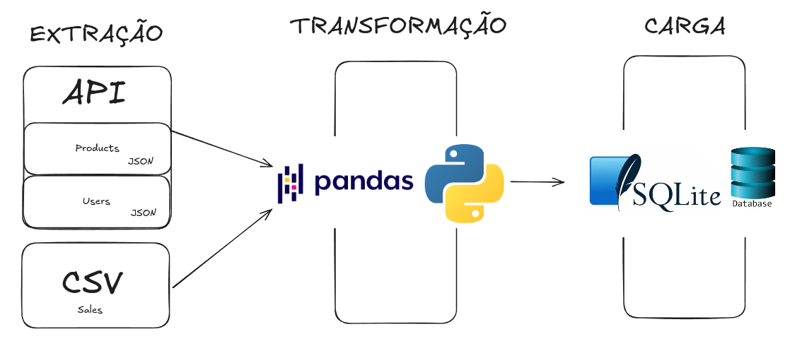

# Projeto ETL - Extração, Transformação e Carga de Dados de Produtos e Vendas

Este projeto implementa um pipeline de **ETL** (Extract, Transform, Load) que extrai dados de uma API falsa de ecommerce, transforma os dados e os carrega em um banco de dados SQLite. O pipeline inclui a geração de um arquivo CSV simulado para vendas, e carrega os dados das tabelas `products`, `users` e `sales` em um banco de dados.



## Estrutura do Projeto

- **Extractor**: Responsável pela extração dos dados da API falsa.
- **CSVGenerator**: Gera um arquivo CSV simulado de vendas.
- **Transformer**: Realiza as transformações necessárias nos dados, como a formatação e limpeza.
- **Loader**: Carrega os dados transformados no banco de dados SQLite.
- **loguru**: Biblioteca para log de execução do pipeline.

## Tecnologias Utilizadas

- Python 3.x
- Pandas
- SQLite
- Requests
- loguru

## Funcionalidade do Projeto

### 1. **Extração de Dados**
   - O projeto extrai dados de produtos e usuários de uma API externa (FakeStoreAPI).
   - Produtos e usuários são carregados através da classe `Extractor`.

### 2. **Geração de Dados Simulados de Vendas**
   - A partir dos dados de produtos e usuários, a classe `CSVGenerator` cria um arquivo CSV de vendas simuladas.
   - Cada venda é associada a um produto, usuário, data de compra, método de pagamento, quantidade e total da compra.

### 3. **Transformação de Dados**
   - A classe `Transformer` transforma os dados de produtos e usuários para um formato adequado ao modelo de banco de dados.
   - Produtos têm informações de rating e categoria ajustadas, e os usuários têm dados de endereço e nome formatados.

### 4. **Carga de Dados no Banco de Dados**
   - A classe `Loader` carrega os dados transformados no banco de dados SQLite.
   - Três tabelas são criadas: `products`, `users` e `sales`.

## Como Rodar o Projeto

### Pré-requisitos

1. Python 3.x instalado.
2. Dependências do projeto instaladas. Você pode usar um ambiente virtual para facilitar o gerenciamento das dependências.

### Instalação

Clone este repositório em seu computador:

```bash
git clone https://github.com/esscova/etl_store.git
cd etl_store
```

Crie um ambiente virtual e instale as dependências:

```bash
python3 -m venv venv
source venv/bin/activate  # No Windows, use: venv\Scripts\activate
pip install -r requirements.txt
```

Onde o arquivo `requirements.txt` contém as bibliotecas necessárias, como:

```
pandas
requests
loguru
```

### Executando o Pipeline ETL

Para executar o pipeline ETL, basta rodar o script `pipeline.py`:

```bash
python pipeline.py
```

O pipeline executará as etapas de **extração**, **transformação** e **carga**. Durante a execução, os logs serão gerados utilizando a biblioteca `loguru`, e você verá informações sobre cada etapa no terminal.

Os seguintes arquivos serão criados:

- **data/vendas.csv**: Arquivo CSV com os dados simulados de vendas.
- **data/ecommerce.db**: Banco de dados SQLite com as tabelas `products`, `users` e `sales` populadas.

## Estrutura de Pastas

A estrutura de diretórios do projeto é a seguinte:

```
/projeto-etl
│
├── data/
│   ├── vendas.csv         # Arquivo CSV de vendas simuladas
│   └── ecommerce.db       # Banco de dados SQLite
│
├── pipeline.py            # Script principal do pipeline ETL
├── utils.py               # Arquivo com as classes para extração, transformação e carga de dados
├── requirements.txt       # Arquivo com as dependências do projeto
├── testes.ipnb            # Notebook utilizado com laboratório
└── README.md              # Este arquivo
```
